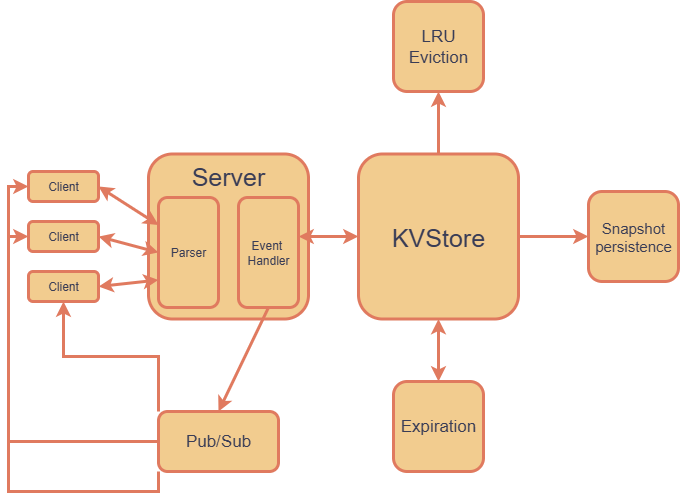

# Redis-Clone
Making a Redis clone from scratch using C++. Inspired by the build your own x repo.

## Features
- **Concurrent** TCP connection with **RESP protocol** (Thread pool with Boost)
- In-memory key-value store **(Strings, Lists, Sets, Hashes)**
- **Commands supported**
  - Basic: PING, ECHO, DEL, EXISTS, FLUSHALL
  - String: SET, GET, INCR, DCR, INCRBY, DCRBY, MGET, APPEND
  - Key expiration: EXPIRE, TTL, PERSIST
  - List: LPUSH, RPUSH, LPOP, RPOP, LRANGE, LLEN, LINDEX, LSET, LREM
  - Set: SADD, SREM, SISMEMBER, SMEMBERS, SCARD, SPOP
  - Hash: HSET, HGET, HDEL, HEXISTS, HLEN, HKEYS, HVALS, HMGET, HGETALL
  - Pub/Sub: PUBLISH, SUBSCRIBE, UNSUBSCRIBE
  - Transaction: MULTI, EXEC, DISCARD
- **Key expiration**
- **Pub/Sub** support
- **Transaction** support command queueing
- **LRU eviction** for memory management
- **Snapshotting** with Boost binary serialization (Persistence)
- Thread-safe access with **fine-grained locking** with TBB
- **Catch2 unit testing** with CI workflows

## Layout


## File structure
```
├── data
│   └── dump.rdb //Holds the kvstore on shutdown or save
├── include
│   ├── LRU.hpp         //Eviction logic for max key limit
│   ├── commands.hpp 
│   ├── config.h        //Consts for fixed values (can be tweaked)
│   ├── expire.hpp 
│   ├── kvstore.hpp
│   ├── parser.hpp
│   ├── pubsub.hpp
│   ├── respvalue.hpp   //Is the value in the kvstore (type,value)
│   ├── server.hpp 
│   ├── session.hpp     //Struct for client connection management
│   ├── snapshot.hpp 
│   └── util.hpp        //Helper file to store uncategorized functions
├── main
├── src
│   ├── client.cpp      //Client logic that communicates with 
│   ├── commands.cpp    //Command logic
│   ├── expire.cpp      //Expiration logic
│   ├── kvstore.cpp     //Main store!
│   ├── main.cpp        //Basic main to start server
│   ├── parser.cpp      //Parsing logic
│   ├── pubsub.cpp      //Pub/Sub message broker logic
│   ├── server.cpp      //TCP connection and event loop
│   └── snapshot.cpp    //Persistence logic
├── test                 
│   ├── test_basic.cpp
│   ├── test_expiration.cpp
│   ├── test_hash.cpp
│   ├── test_list.cpp
│   ├── test_misc.cpp
│   ├── test_persistence.cpp
│   ├── test_set.cpp
│   └── test_string.cpp
```

## Demo
TBD

## Build

### Prerequisites
- C++20 compiler
- Run on WSL or Linux
- [TBB (oneAPI Threading Building Blocks)](https://github.com/oneapi-src/oneTBB)
- [Boost](https://www.boost.org/) (serialization, asio)
- CMake
- Catch2 testing (submodule downloaded if using steps to build

### Steps to build
```sh
git clone https://github.com/BHalacsy/Redis-Clone
cd Redis-Clone
git submodule update --init -recursive
cmake .
cmake --build .
```

### Run
The server:
```./redis_server```
The client:
```./redis_client```

### Usage
For specifics on various implemented redis commands I recommend looking at the [redis docs](https://redis.io/docs/latest/commands) for what you may be looking for.

## Future plans
I would like to down the line, implement the [Blocking operations](https://redis.io/docs/latest/develop/data-types/lists/#blocking-operations-on-lists) for task queueing with something like [Celery](https://docs.celeryq.dev/en/main/getting-started/introduction.html). 
As well as I plan to make my own full-stack portfolio website with the main database being my redis-clone. TBD.
